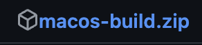
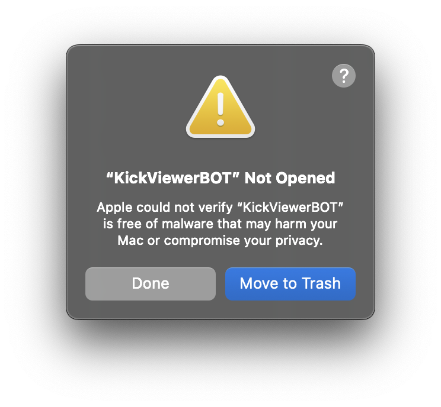
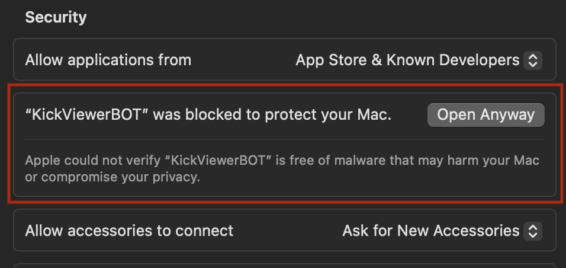
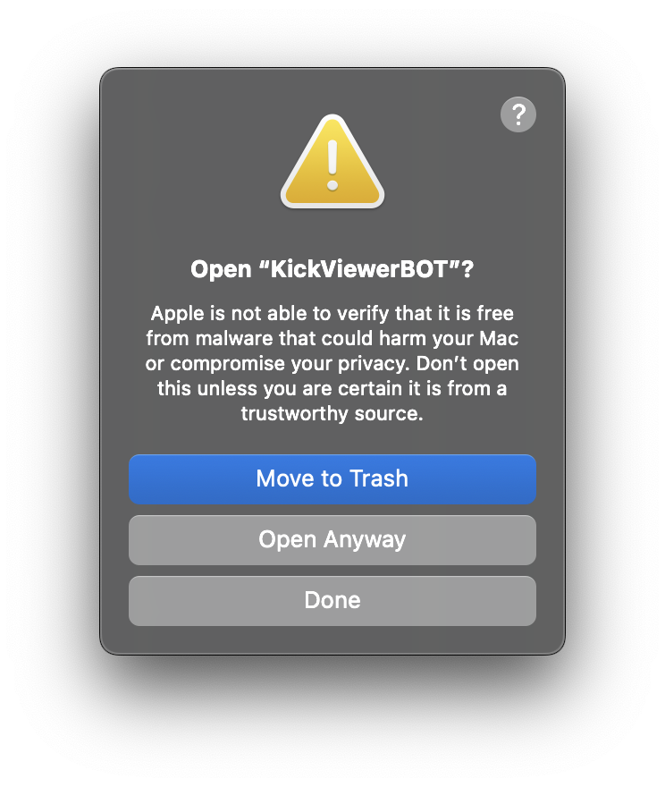

# Kick Viewer Bot

A powerful, enterprise-grade web application for generating Kick views using proxy rotation technology. Built with a Flask backend and React frontend, this solution offers a seamless experience with production-ready performance.

## Warning

⚠️ **EDUCATIONAL PURPOSE ONLY** ⚠️

This software is provided strictly for educational and research purposes. Using this tool to manipulate viewing metrics may violate Kick's Terms of Service and applicable laws. The developers assume no responsibility for misuse of this software.

## Table of Contents

- [Features](#features)
- [Requirements](#requirements)
- [Installation](#installation)
- [Installation [DEV]](#installation-dev)
- [Usage [DEV]](#usage-dev)
- [How to use with macOS](#how-to-use-with-macos)
- [Screenshots](#screenshots)
- [License](#license)
- [Warning](#warning)

## Features

- 🚀 High-performance multi-threading system supporting up to 1000 concurrent connections
- 🔄 Intelligent proxy rotation with automatic failover mechanisms
- 🌐 Comprehensive proxy protocol support (HTTP, SOCKS4, SOCKS5)
- 📊 Real-time analytics dashboard with performance metrics
- 🔒 Enterprise-grade SSL/HTTPS security implementation
- 📱 Responsive and intuitive web interface optimized for all devices
- ⚙️ Advanced configuration options for power users
- 🔌 **WebSocket Integration** - Updated to work with Kick's new security measures (Fix for Issue #14)

## Requirements

- Python 3.9+
- Modern web browser with JavaScript enabled
- Stable internet connection (minimum 5Mbps recommended)
- (Optional) Custom proxy list for enhanced performance

## 💻 Installation

1. Download the latest release executable from our [official website](https://velbots.shop)
2. Launch the application with administrator/root privileges
3. Create an account or log in with existing credentials
4. Configure your viewing preferences and proxy settings
5. Start the bot and monitor real-time statistics

## Installation [DEV]

1. Clone the repository:
   ```shell
   git clone https://github.com/H1B0B0/Kick-Viewerbot.git
   ```
2. Navigate into the project directory:
   ```shell
   cd Kick-Viewerbot
   ```
3. Install the required Python dependencies:
   ```shell
   pip install -r requirements.txt
   ```
4. Build the static Frontend assets:

   Windows:

   ```shell
   ./build.ps1
   ```

   Linux/macOS:

   ```shell
   ./build.sh
   ```

5. Launch the development backend server:
   ```shell
   python ./backend/main.py --dev
   ```

## Usage [DEV]

1. Access the application interface at `https://velbots.shop`
2. Configure thread count according to your system capabilities
3. Enter the target Kick channel name (case-sensitive)
4. (Optional) Upload a custom proxy list in IP:PORT format
5. Click "Start bot" to begin the viewing session
6. Monitor performance metrics in real-time on the dashboard

## How to use with macOS

1. Download the optimized macOS build from our [official releases page](https://github.com/H1B0B0/Kick-Viewerbot/releases)
   
2. When launching, you may encounter a security warning as the application uses advanced system features
   
3. Navigate to `System Settings` → `Privacy & Security`. Locate the message about the blocked application and click `Open Anyway`
   
4. Confirm your intent by clicking `Open Anyway` in the subsequent security dialog
   
5. The application will initialize. Configure your settings and begin generating views. Enjoy the power of enterprise-grade technology 🚀

## 📸 Screenshots


## License

This project is licensed under the MIT License. See the [LICENSE](LICENSE) file for detailed terms and conditions.
